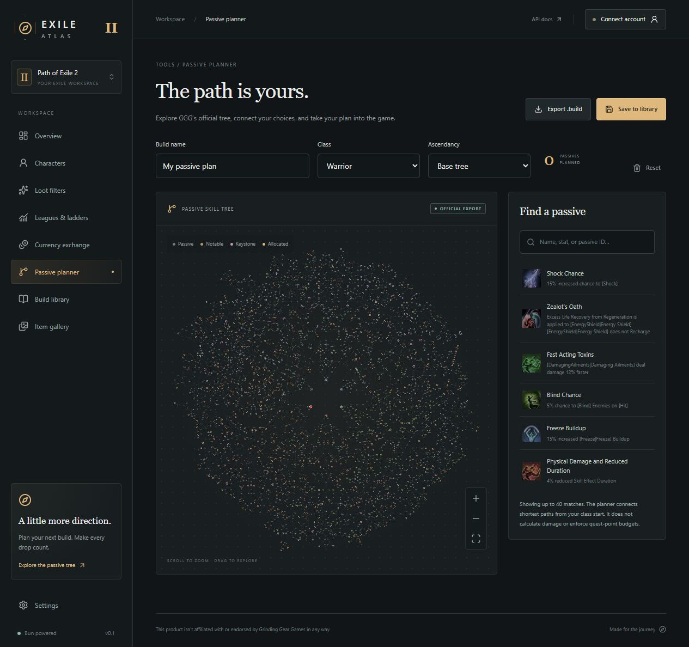

# Tailnet production deployment

Repository: https://github.com/MrWinRock/exile-atlas. Pushes to `master` run Bun tests, lint and generated Next route type checks, build the Docker image and publish `ghcr.io/mrwinrock/exile-atlas` with `master` and full commit-SHA tags. The build performs Next production compilation inside the Dockerfile. Registry actions are pinned to commit SHAs.

The VPS stack lives at `/opt/stacks/exile-atlas/docker-compose.yml`. It pulls a published image digest; it does not build source on the VPS. PostgreSQL and Redis are internal-only with named persistent volumes. A schema setup container completes before web/worker startup. Web binds only to `127.0.0.1:3210`; Tailscale Serve provides private HTTPS at `https://labs.tail262442.ts.net:3211`. GGG account OAuth remains unconfigured until an approved client is registered with its callback.

## Server preparation

On the authorized VPS, verify Docker Compose, Tailscale, curl, Python 3, openssl and flock are installed; verify the selected ports are free and the deployment user can run Docker and Tailscale Serve. Create `/opt/stacks/exile-atlas` owned by the deployment user, copy `.env.example` into its `.env`, and restrict the environment to mode 600. Generate a fresh PostgreSQL password and token-encryption key using `openssl rand -hex 32`; never print them or commit the populated environment. Set `APP_URL=https://labs.tail262442.ts.net:3211` and `WEB_PORT=3210`. Preserve these values and data volumes across updates. The update script adds only this dedicated Serve port and preserves other existing private routes.

Deployment runs on a GitHub-hosted runner. It joins the tailnet as an ephemeral `tag:ci` device using Tailscale OIDC, then uses the dedicated repository SSH key to connect as `nongwin` on private port 2222. The key disables forwarding and PTY allocation. The verified VPS Ed25519 host key is pinned in `deploy/known_hosts`; host-key changes must be verified through the existing trusted administration connection before updating that file. The workflow has no pull-request trigger.

Set repository variables `TS_OAUTH_CLIENT_ID` and `TS_AUDIENCE`, and secret `DEPLOY_SSH_KEY`. The Tailscale trust credential needs Auth Keys write access for `tag:ci`, whose tailnet policy must permit TCP 2222 to the VPS. This repository's verified immutable subject is `repo:MrWinRock@78248227/exile-atlas@1404447651:ref:refs/heads/master`. Generate a dedicated Ed25519 key, keep its private half in the GitHub secret, and supply its public half as `EXILE_DEPLOY_PUBLIC_KEY` when running `deploy/bootstrap.sh` on the VPS. Bootstrap creates fresh secrets only when `.env` does not exist and preserves other authorized keys.

Once the environment and key are ready, set repository variable `TAILNET_DEPLOY_ENABLED=true`. `deploy/ssh-deploy.sh` copies the deployment Compose, update script and image-recording helper, then passes the job's short-lived, repository-scoped registry token through encrypted SSH stdin. A permanent registry PAT is unnecessary. Registry credentials use a temporary Docker config which is cleaned after the job. Packages can retain their default private visibility.

The VPS architecture was verified as x86_64; the published app image targets Linux AMD64.

## Deployment and rollback

`deploy/update.sh /opt/stacks/exile-atlas` requires `EXILE_ATLAS_IMAGE=ghcr.io/mrwinrock/exile-atlas@sha256:<64 hex digits>`. In CI the workflow supplies this exact digest. It locks the stack, installs `docker-compose.yml`, validates the private endpoint, pulls images, waits for container health, configures Tailscale Serve and verifies the HTTPS API. Only after success is the image recorded atomically in `.env`, preserving other secrets. This lets plain Compose commands work without extra flags. The same digest is mirrored in `image.env`; the previous successful image is kept in `previous-image.env`. Deploying the same digest again preserves the earlier rollback target.

For manual operations on the VPS:

```sh
cd /opt/stacks/exile-atlas
docker compose ps
docker compose logs --tail 50 web worker db-setup
```

After a **failed deployment**, `.env` still records the most recent healthy release; `docker compose up -d --wait web worker` can restore it. After a **successful deployment**, roll back to the earlier healthy release using `previous-image.env`. Supply the chosen digest to `deploy/update.sh`. A locally cached digest needs no registry token; an uncached private image requires registry credentials. If the first-ever deployment fails there is no earlier release to restore. Do not use `down -v`: database/history volumes are persistent. Back up PostgreSQL before schema-changing deployments. Browser drafts remain in each browser's local storage; they are not copied from the development machine to the VPS.

## Current setup state

Live site: https://labs.tail262442.ts.net:3211/ (connect to the tailnet first). Stack: `/opt/stacks/exile-atlas/docker-compose.yml`.

[Build and deployment run 37219711411](https://github.com/MrWinRock/exile-atlas/actions/runs/37219711411) passed: tests, lint, type checks, image publication, GitHub OIDC login, private SSH, GHCR pull, database setup and application startup. Deployed app commit: `c5e38a8`. Image digest: `sha256:2fea814356c7b9e080421f8af632e7f01d9c7d75426c73d51978a7b9b1cf12fe`.

Follow-up fixed direct Compose commands by persisting the last healthy image into `.env` and retiring the competing root `compose.yaml` to `deploy/legacy-compose.yaml`. After automatic redeployment, a fresh SSH session verified plain `docker compose ps`, the root `docker-compose.yml`, mode-600 `.env`, the published digest and the loopback-only backend binding. HTTPS API status is verified from the connected Windows peer with normal certificate validation; web/PostgreSQL/Redis are healthy and worker is running. Both database services have no host ports and retained their existing volumes. Temporary local deployment-key copies were removed; the private key is retained only as the encrypted GitHub repository secret. GGG OAuth remains unconfigured.


